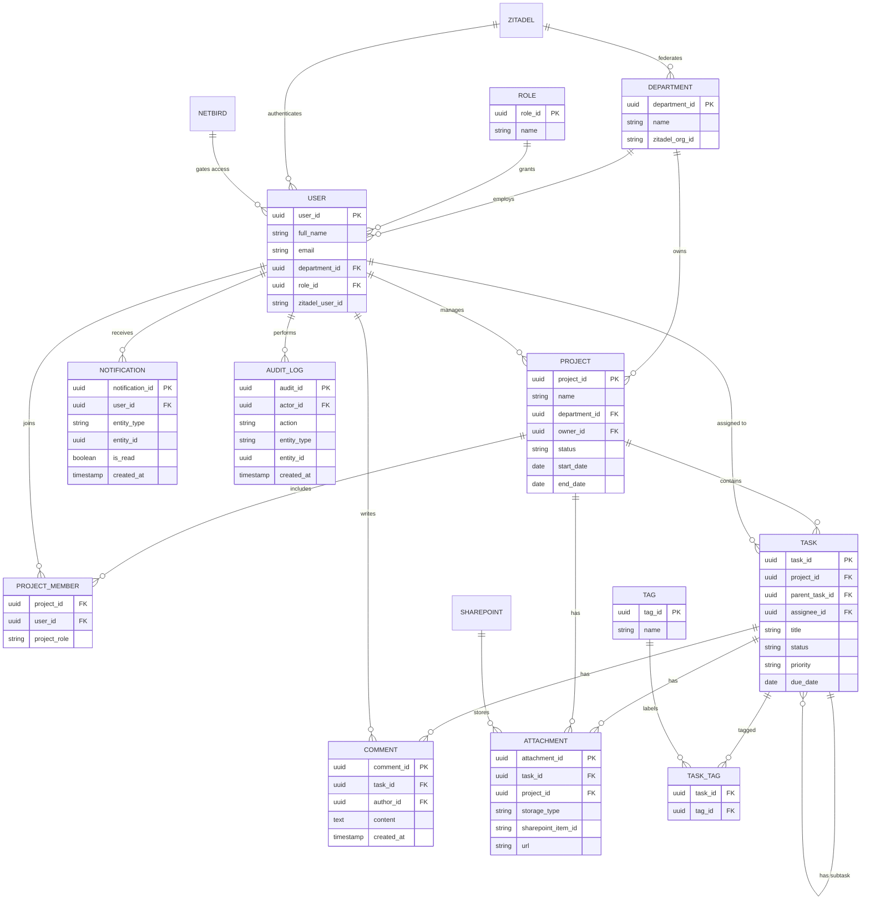

# Entity Relationship Diagram — Project Management Web App

> Converted from `Entity Relationship Diagram - Project Management Web App.drawio` for repo review/reference. Diagram is redrawn as a [Mermaid](https://mermaid.js.org/syntax/entityRelationshipDiagram.html) `erDiagram`, which GitHub renders natively in Markdown — no external viewer needed. Entity names, field names, and PK/FK markers are unchanged from the source `.drawio` file.

## Diagram

`ZITADEL`, `NETBIRD`, and `SHAREPOINT` are external systems (no owned schema in this database) — see [External systems](#external-systems) below for their role.

## Entities & fields

### DEPARTMENT

| Field | Type | Key |
|---|---|---|
| department_id | uuid | PK |
| name | string | |
| zitadel_org_id | string | |

### ROLE

| Field | Type | Key |
|---|---|---|
| role_id | uuid | PK |
| name | string | |

### USER

| Field | Type | Key |
|---|---|---|
| user_id | uuid | PK |
| full_name | string | |
| email | string | |
| department_id | uuid | FK → DEPARTMENT |
| role_id | uuid | FK → ROLE |
| zitadel_user_id | string | |

### PROJECT

| Field | Type | Key |
|---|---|---|
| project_id | uuid | PK |
| name | string | |
| department_id | uuid | FK → DEPARTMENT |
| owner_id | uuid | FK → USER |
| status | string | |
| start_date | date | |
| end_date | date | |

### PROJECT_MEMBER *(join table: PROJECT ↔ USER)*

| Field | Type | Key |
|---|---|---|
| project_id | uuid | FK → PROJECT |
| user_id | uuid | FK → USER |
| project_role | string | |

### TASK

| Field | Type | Key |
|---|---|---|
| task_id | uuid | PK |
| project_id | uuid | FK → PROJECT |
| parent_task_id | uuid | FK → TASK (self, for subtasks) |
| assignee_id | uuid | FK → USER |
| title | string | |
| status | string | |
| priority | string | |
| due_date | date | |

### COMMENT

| Field | Type | Key |
|---|---|---|
| comment_id | uuid | PK |
| task_id | uuid | FK → TASK |
| author_id | uuid | FK → USER |
| content | text | |
| created_at | timestamp | |

### ATTACHMENT

| Field | Type | Key |
|---|---|---|
| attachment_id | uuid | PK |
| task_id | uuid | FK → TASK |
| project_id | uuid | FK → PROJECT |
| storage_type | string | |
| sharepoint_item_id | string | |
| url | string | |

### TAG

| Field | Type | Key |
|---|---|---|
| tag_id | uuid | PK |
| name | string | |

### TASK_TAG *(join table: TASK ↔ TAG)*

| Field | Type | Key |
|---|---|---|
| task_id | uuid | FK → TASK |
| tag_id | uuid | FK → TAG |

### NOTIFICATION

| Field | Type | Key |
|---|---|---|
| notification_id | uuid | PK |
| user_id | uuid | FK → USER |
| entity_type | string | |
| entity_id | uuid | |
| is_read | boolean | |
| created_at | timestamp | |

### AUDIT_LOG

| Field | Type | Key |
|---|---|---|
| audit_id | uuid | PK |
| actor_id | uuid | FK → USER |
| action | string | |
| entity_type | string | |
| entity_id | uuid | |
| created_at | timestamp | |

## Relationships

| From | To | Relationship | Cardinality |
|---|---|---|---|
| DEPARTMENT | USER | employs | 1 : N |
| DEPARTMENT | PROJECT | owns | 1 : N |
| ROLE | USER | grants | 1 : N |
| USER | PROJECT | manages (owner) | 1 : N |
| PROJECT | PROJECT_MEMBER | includes | 1 : N |
| USER | PROJECT_MEMBER | joins | 1 : N |
| PROJECT | TASK | contains | 1 : N |
| TASK | TASK | has subtask (self-reference via parent_task_id) | 1 : N |
| USER | TASK | assigned to | 1 : N |
| TASK | COMMENT | has | 1 : N |
| USER | COMMENT | writes | 1 : N |
| TASK | ATTACHMENT | has | 1 : N |
| PROJECT | ATTACHMENT | has | 1 : N |
| TASK | TASK_TAG | tagged | 1 : N |
| TAG | TASK_TAG | labels | 1 : N |
| USER | NOTIFICATION | receives | 1 : N |
| USER | AUDIT_LOG | performs | 1 : N |

`PROJECT_MEMBER` and `TASK_TAG` are association/join tables — together they express the underlying many-to-many relationships (PROJECT↔USER and TASK↔TAG respectively).

## External systems

| System | Role | Integration |
|---|---|---|
| **Zitadel** (self-host) | IAM / SSO | Federates each DEPARTMENT as a Zitadel Organization (org-per-department multi-tenancy); authenticates USER via OIDC |
| **NetBird** (self-host) | Zero-trust admin VPN | Gates network-level access for USER; identity source is OIDC-linked to Zitadel |
| **SharePoint** | Document storage | Stores ATTACHMENT content, accessed via Microsoft Graph API |

---

*See also: [`PRD.md`](./PRD.md) for product context, [`SRS.md`](./SRS.md) for the functional requirements this data model supports.*
