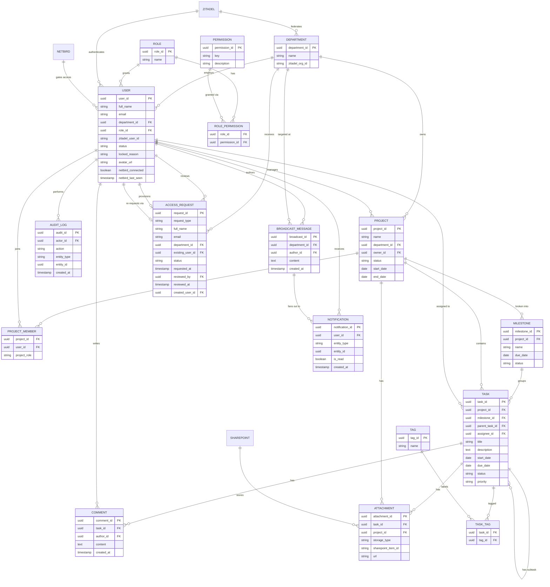

# Sơ đồ Quan hệ Thực thể (ERD) — Ứng dụng Web Quản lý Dự án

> Bản dịch tiếng Việt của `ERD.md`. Tên thực thể (entity), tên trường (field), và ký hiệu khóa chính/khóa ngoại (PK/FK) được **giữ nguyên bằng tiếng Anh** vì đây là định danh trong schema/code, không nên dịch. Phần lời giải thích, tiêu đề mục, và mô tả được dịch sang tiếng Việt.
>
> **Ghi chú phiên bản (v2):** cập nhật sau khi đối chiếu `Project_Management_Functional_Requirements.pdf` với sơ đồ này, `PRD.md`, và `SRS.md`. Có 6 thay đổi — 4 thực thể mới (`MILESTONE`, `PERMISSION`, `ROLE_PERMISSION`, `BROADCAST_MESSAGE`) và bổ sung cho 3 thực thể đã có (`TASK`, `USER`, `ACCESS_REQUEST`) — để lấp các khoảng trống mà bảng FR phát hiện nhưng bản v1 chưa thể hiện được. Mỗi thay đổi được giải thích trong mục riêng bên dưới; không có gì ở v1 bị xóa hoặc đổi tên.

## Sơ đồ (Diagram)

Khối mã Mermaid dưới đây được **giữ nguyên bằng tiếng Anh** — đây là code render trực tiếp trên GitHub, dịch nhãn quan hệ có thể làm rối sơ đồ mà không tăng thêm giá trị.

`ZITADEL`, `NETBIRD`, và `SHAREPOINT` là hệ thống bên ngoài (không có schema riêng trong database này) — xem [Hệ thống bên ngoài](#hệ-thống-bên-ngoài) bên dưới.

## Thực thể & các trường

### DEPARTMENT (Phòng ban)

| Trường | Kiểu | Khóa |
|---|---|---|
| department_id | uuid | PK |
| name | string | |
| zitadel_org_id | string | |

### ROLE (Vai trò)

| Trường | Kiểu | Khóa |
|---|---|---|
| role_id | uuid | PK |
| name | string | |

### USER (Người dùng)

| Trường | Kiểu | Khóa |
|---|---|---|
| user_id | uuid | PK |
| full_name | string | |
| email | string | |
| department_id | uuid | FK → DEPARTMENT |
| role_id | uuid | FK → ROLE |
| zitadel_user_id | string | |
| status | string | `ACTIVE` \| `LOCKED` — bản sao cache của trạng thái khóa tài khoản, đồng bộ từ Zitadel qua webhook/event |
| locked_reason | string | Tùy chọn, có thể null. Ghi chú nội bộ app (vd. "đã nghỉ việc", "đang bị điều tra") — không phải dữ liệu định danh nên không lưu ở Zitadel |
| avatar_url | string | Có thể null. Ảnh đại diện — hỗ trợ tính năng "Đổi ảnh đại diện" (mọi vai trò) |
| netbird_connected | boolean | Cache, chỉ đọc. Đồng bộ từ NetBird qua webhook/poll — xem [Trạng thái kết nối NetBird](#trạng-thái-kết-nối-netbird) |
| netbird_last_seen | timestamp | Có thể null. Lần cuối NetBird ghi nhận user này đang kết nối |

### ACCESS_REQUEST (Yêu cầu cấp quyền truy cập)

Trạng thái trước-khi-có-tài-khoản **hoặc** yêu cầu lại sau khi bị khóa — xem [Luồng yêu cầu truy cập / onboarding](#luồng-yêu-cầu-truy-cập--onboarding).

| Trường | Kiểu | Khóa |
|---|---|---|
| request_id | uuid | PK |
| request_type | string | `NEW_ACCOUNT` (mặc định) \| `UNLOCK_REQUEST` |
| full_name | string | |
| email | string | |
| department_id | uuid | FK → DEPARTMENT (phòng ban được yêu cầu) |
| existing_user_id | uuid | FK → USER, có thể null — được set khi `request_type = UNLOCK_REQUEST`, liên kết đến tài khoản đang bị khóa |
| status | string | `PENDING` \| `APPROVED` \| `REJECTED` |
| requested_at | timestamp | |
| reviewed_by | uuid | FK → USER, có thể null — admin đã duyệt/từ chối |
| reviewed_at | timestamp | có thể null |
| created_user_id | uuid | FK → USER, có thể null — được set khi duyệt xong và tạo tài khoản (chỉ áp dụng luồng NEW_ACCOUNT) |

### PROJECT (Dự án)

| Trường | Kiểu | Khóa |
|---|---|---|
| project_id | uuid | PK |
| name | string | |
| department_id | uuid | FK → DEPARTMENT |
| owner_id | uuid | FK → USER |
| status | string | |
| start_date | date | |
| end_date | date | |

### PROJECT_MEMBER *(bảng nối: PROJECT ↔ USER)*

| Trường | Kiểu | Khóa |
|---|---|---|
| project_id | uuid | FK → PROJECT |
| user_id | uuid | FK → USER |
| project_role | string | |

### MILESTONE (Cột mốc)

| Trường | Kiểu | Khóa |
|---|---|---|
| milestone_id | uuid | PK |
| project_id | uuid | FK → PROJECT |
| name | string | |
| due_date | date | |
| status | string | |

### TASK (Công việc)

| Trường | Kiểu | Khóa |
|---|---|---|
| task_id | uuid | PK |
| project_id | uuid | FK → PROJECT |
| milestone_id | uuid | FK → MILESTONE, có thể null — task có thể thuộc một milestone hoặc gắn trực tiếp vào project |
| parent_task_id | uuid | FK → TASK (tự tham chiếu, dùng cho subtask) |
| assignee_id | uuid | FK → USER |
| title | string | |
| description | text | Có thể null. Nội dung mô tả chi tiết task, khác với `title` — hỗ trợ tính năng "Cập nhật mô tả Task" (PM/Admin) |
| start_date | date | Có thể null. Kết hợp với `due_date` để xác định thanh (bar) hiển thị trong Gantt view — xem [Lên lịch Task (hỗ trợ Gantt)](#lên-lịch-task-hỗ-trợ-gantt) |
| due_date | date | |
| status | string | |
| priority | string | |

### COMMENT (Bình luận)

| Trường | Kiểu | Khóa |
|---|---|---|
| comment_id | uuid | PK |
| task_id | uuid | FK → TASK |
| author_id | uuid | FK → USER |
| content | text | |
| created_at | timestamp | |

### ATTACHMENT (Tệp đính kèm)

| Trường | Kiểu | Khóa |
|---|---|---|
| attachment_id | uuid | PK |
| task_id | uuid | FK → TASK |
| project_id | uuid | FK → PROJECT |
| storage_type | string | |
| sharepoint_item_id | string | |
| url | string | |

### TAG (Thẻ gắn nhãn)

| Trường | Kiểu | Khóa |
|---|---|---|
| tag_id | uuid | PK |
| name | string | |

### TASK_TAG *(bảng nối: TASK ↔ TAG)*

| Trường | Kiểu | Khóa |
|---|---|---|
| task_id | uuid | FK → TASK |
| tag_id | uuid | FK → TAG |

### NOTIFICATION (Thông báo)

| Trường | Kiểu | Khóa |
|---|---|---|
| notification_id | uuid | PK |
| user_id | uuid | FK → USER |
| entity_type | string | Bao gồm cả `BROADCAST_MESSAGE` bên cạnh các loại đã có (`TASK`, `COMMENT`, v.v.) |
| entity_id | uuid | Đa hình (polymorphic) — không có ràng buộc FK ở tầng DB, giống v1 |
| is_read | boolean | |
| created_at | timestamp | |

### AUDIT_LOG (Nhật ký hoạt động)

| Trường | Kiểu | Khóa |
|---|---|---|
| audit_id | uuid | PK |
| actor_id | uuid | FK → USER |
| action | string | |
| entity_type | string | |
| entity_id | uuid | |
| created_at | timestamp | |

### PERMISSION (Quyền)

Dữ liệu khởi tạo (seed data) phản ánh khoảng 25 dòng trong bảng Functional Requirements (vd. `task.status.update`, `task.crud`, `project.crud`, `audit_log.view`, `user.role.change`…).

| Trường | Kiểu | Khóa |
|---|---|---|
| permission_id | uuid | PK |
| key | string | Mã định danh ổn định, máy đọc được, vd. `task.status.update` |
| description | string | Nhãn dễ đọc cho người dùng, vd. "Update Task's Status" |

### ROLE_PERMISSION *(bảng nối: ROLE ↔ PERMISSION)*

| Trường | Kiểu | Khóa |
|---|---|---|
| role_id | uuid | FK → ROLE |
| permission_id | uuid | FK → PERMISSION |

### BROADCAST_MESSAGE (Thông báo toàn hệ thống)

| Trường | Kiểu | Khóa |
|---|---|---|
| broadcast_id | uuid | PK |
| department_id | uuid | FK → DEPARTMENT — workspace mà thông báo nhắm đến |
| author_id | uuid | FK → USER (Leader) |
| content | text | |
| created_at | timestamp | |

## Quan hệ (Relationships)

| Từ | Đến | Quan hệ | Số lượng |
|---|---|---|---|
| DEPARTMENT | USER | quản lý nhân sự | 1 : N |
| DEPARTMENT | PROJECT | sở hữu | 1 : N |
| ROLE | USER | cấp vai trò | 1 : N |
| USER | PROJECT | quản lý (chủ dự án) | 1 : N |
| PROJECT | PROJECT_MEMBER | bao gồm | 1 : N |
| USER | PROJECT_MEMBER | tham gia | 1 : N |
| PROJECT | MILESTONE | chia thành | 1 : N |
| MILESTONE | TASK | nhóm các | 1 : N |
| PROJECT | TASK | chứa | 1 : N |
| TASK | TASK | có subtask (tự tham chiếu qua parent_task_id) | 1 : N |
| USER | TASK | được giao cho | 1 : N |
| TASK | COMMENT | có | 1 : N |
| USER | COMMENT | viết | 1 : N |
| TASK | ATTACHMENT | có | 1 : N |
| PROJECT | ATTACHMENT | có | 1 : N |
| TASK | TASK_TAG | được gắn thẻ | 1 : N |
| TAG | TASK_TAG | gắn nhãn | 1 : N |
| USER | NOTIFICATION | nhận | 1 : N |
| USER | AUDIT_LOG | thực hiện | 1 : N |
| ROLE | ROLE_PERMISSION | có | 1 : N |
| PERMISSION | ROLE_PERMISSION | được cấp qua | 1 : N |
| USER | BROADCAST_MESSAGE | là tác giả | 1 : N |
| DEPARTMENT | BROADCAST_MESSAGE | được nhắm đến | 1 : N |
| BROADCAST_MESSAGE | NOTIFICATION | phân phối đến (đa hình, qua entity_type/entity_id) | 1 : N |
| DEPARTMENT | ACCESS_REQUEST | nhận | 1 : N |
| USER | ACCESS_REQUEST | duyệt (admin) | 1 : N |
| USER | ACCESS_REQUEST | cấp tài khoản (tạo tài khoản) | 1 : 0..1 |
| USER | ACCESS_REQUEST | yêu cầu lại qua (tài khoản bị khóa, UNLOCK_REQUEST) | 1 : 0..N |

`PROJECT_MEMBER`, `TASK_TAG`, và `ROLE_PERMISSION` là các bảng nối (association/join table) — thể hiện quan hệ nhiều-nhiều (many-to-many) tương ứng: PROJECT↔USER, TASK↔TAG, và ROLE↔PERMISSION.

## Hệ thống bên ngoài

| Hệ thống | Vai trò | Tích hợp |
|---|---|---|
| **Zitadel** (self-host) | IAM / SSO | Ánh xạ mỗi DEPARTMENT thành một Zitadel Organization (mô hình multi-tenant theo phòng ban); xác thực USER qua OIDC |
| **NetBird** (self-host) | VPN quản trị zero-trust | Kiểm soát truy cập tầng mạng cho USER; nguồn định danh liên kết OIDC với Zitadel |
| **SharePoint** | Lưu trữ tài liệu | Lưu nội dung ATTACHMENT, truy cập qua Microsoft Graph API |

## Khóa/Mở khóa tài khoản

Việc khóa tài khoản người dùng được xử lý ở **tầng Zitadel**, không phải ở tầng app, vì Zitadel là nguồn định danh duy nhất cho cả app này lẫn NetBird (khi admin khóa một user, cả quyền truy cập app *và* quyền truy cập VPN NetBird đều phải bị chặn cùng lúc, không để tình trạng "khóa nửa vời").

- Hành động khóa của admin đi qua state vòng đời tài khoản của Zitadel (khác với deactivation), không phải một cờ (flag) thuộc database này.
- `USER.status` là **bản cache chỉ đọc** của trạng thái đó, được đồng bộ qua webhook/event của Zitadel, để app có thể lọc user "đang hoạt động" (vd. chọn assignee, dashboard workload) mà không cần gọi API trực tiếp mỗi lần. Đây không bao giờ là nguồn dữ liệu gốc (source of truth) và không được app tự ý thay đổi trực tiếp — việc khóa thực sự diễn ra ở Zitadel (token không còn hợp lệ) và, để phòng vệ nhiều lớp (defense-in-depth), kiểm tra thêm trường cache này ở tầng Spring Security.
- `USER.locked_reason` là metadata nội bộ app mà Zitadel không có khái niệm, do admin thực hiện khóa nhập vào.
- Hành động khóa/mở khóa được ghi lại như một dòng `AUDIT_LOG` bình thường (`action = 'LOCK_USER'` / `'UNLOCK_USER'`, `actor_id` = admin, `entity_type = 'USER'`, `entity_id` = user bị tác động) — không cần thực thể mới, theo đúng mô hình audit sẵn có của FR-6.
- Một user bị khóa muốn được phục hồi sẽ thực hiện qua `ACCESS_REQUEST` với `request_type = UNLOCK_REQUEST` và `existing_user_id` được set — xem bên dưới.

## Trạng thái kết nối NetBird

Tính năng "Xem tài khoản nào đang kết nối đúng qua NetBird" của Admin (trong bảng FR) cần một trạng thái có thể truy vấn theo từng user, điều mà v1 chưa mô hình hóa (NetBird trước đó chỉ là cổng chặn ở tầng mạng, không phải nguồn dữ liệu).

- `USER.netbird_connected` và `USER.netbird_last_seen` là **bản cache chỉ đọc**, theo đúng khuôn mẫu như `USER.status` — đồng bộ qua webhook hoặc poll định kỳ từ NetBird, không bao giờ được app ghi trực tiếp.
- Đây chỉ mang tính thông tin cho giao diện Admin; bản thân nó không thực thi việc kiểm soát truy cập — cổng chặn thực sự vẫn là chính sách mạng của NetBird, liên kết OIDC với Zitadel.

## Ma trận phân quyền (RBAC permissions)

Tính năng "Adjust Ability Authority" / "Authority Matrix" của Admin trong bảng FR ngụ ý quyền hạn phải **chỉnh sửa được lúc runtime bởi admin**, không hardcode — nên `ROLE` (chỉ là nhãn phẳng `{role_id, name}`) là chưa đủ.

- `PERMISSION` là bảng danh mục, mỗi dòng tương ứng một quyền trong tài liệu FR (vd. `task.status.update`, `project.crud`, `audit_log.export`) — khoảng 25 dòng ở giai đoạn MVP, khớp 1-1 với danh sách tính năng trong bảng FR.
- `ROLE_PERMISSION` là bảng nối: sự tồn tại của một dòng nghĩa là vai trò đó có quyền tương ứng. Việc thêm/xóa dòng *chính là* "Ma trận phân quyền" mà admin chỉnh sửa.
- 4 dòng `ROLE` (Staff, PM, Leader, Admin) giữ cố định như các vai trò được đặt tên; phần có thể chỉnh sửa là quyền nào gắn với vai trò nào, không phải bản thân các vai trò.
- Mọi endpoint có kiểm soát quyền nên xác định phân quyền bằng cách join `USER → ROLE → ROLE_PERMISSION → PERMISSION`, không hardcode kiểm tra theo tên vai trò trong code — nếu không, ma trận chỉ mang tính hình thức.
- Điều chỉnh ma trận là một sự kiện cấp quyền và bản thân nó nên ghi một dòng `AUDIT_LOG` (`action = 'UPDATE_ROLE_PERMISSION'`), phù hợp với FR-6.
- **Đã xác nhận hướng thiết kế:** đây là Phương án B (ma trận chỉnh sửa được bởi admin) — khớp với mockup "Ma trận phân quyền" đã được xây dựng, với dòng Admin bị khóa/không thể chỉnh sửa cả ở client lẫn server.

## Milestone (Cột mốc)

PRD (5.3) và SRS (FR-3) đều mô tả dự án được chia thành milestone trước khi chia thành task, điều mà sơ đồ v1 chưa thể hiện — `TASK` trước đó chỉ tự tham chiếu để làm subtask, không có tầng nhóm nào ở trên.

- `MILESTONE` nằm giữa `PROJECT` và `TASK`: một project có nhiều milestone, một milestone có nhiều task.
- `TASK.milestone_id` **có thể null** — một task có thể thuộc một milestone, hoặc gắn trực tiếp vào project mà không cần milestone, để các project đơn giản không bị ép phải tạo milestone giả.
- `TASK.project_id` vẫn được giữ dù có thể suy ra gián tiếp qua `milestone_id`, vì các truy vấn task ở cấp project (vd. "tất cả task trong project này" cho các view Kanban/List/Calendar) đủ phổ biến để cần một đường truy vấn trực tiếp, có index, thay vì luôn phải join qua `MILESTONE`.

## Lên lịch Task (hỗ trợ Gantt)

Trong 4 kiểu view của project (Kanban, List, Gantt, Calendar), 3 kiểu render cùng một dữ liệu task theo cách khác nhau ở phía client — không cần thay đổi schema cho các view đó. Gantt là ngoại lệ: một thanh (bar) trong Gantt cần một *khoảng* ngày để vẽ độ rộng, nhưng `TASK` ở v1 chỉ có `due_date` — một mốc thời gian đơn.

- `TASK.start_date` (có thể null) được thêm vào để client tính được vị trí/độ rộng thanh Gantt theo `[start_date, due_date]`.
- `MILESTONE` chủ ý chỉ giữ `due_date` — milestone theo quy ước thường được vẽ như một điểm mốc thời gian (hình thoi) trong Gantt chart, không phải một thanh, nên không cần trường khoảng ngày.
- Nếu `start_date` là null (task chưa có ngày bắt đầu xác định), cách hiển thị dự phòng ở client (vd. một điểm không có độ rộng, hoặc lấy `due_date` cho cả hai đầu) là vấn đề hiển thị, không phải vấn đề schema.

## Thông báo toàn hệ thống (Broadcast messaging)

Tài liệu FR trao cho Leader một tính năng chưa có ở v1: gửi thông báo toàn workspace, hiển thị trong hộp thông báo của từng thành viên.

- `BROADCAST_MESSAGE` là một bảng nhẹ: mỗi dòng là một thông báo, gắn với một `department_id` (workspace được nhắm đến) và do một `USER` (Leader) tạo ra.
- Việc gửi thông báo tái sử dụng cơ chế đa hình (polymorphic) sẵn có của `NOTIFICATION`, vốn đã dùng cho task/comment — một dòng `NOTIFICATION` được tạo cho mỗi thành viên trong phòng ban, với `entity_type = 'BROADCAST_MESSAGE'` và `entity_id = broadcast_id`. Không cần cơ chế gửi mới, chỉ cần một dòng nguồn để tham chiếu (và để audit/export sau này nếu cần) thay vì lặp lại nội dung ở mỗi thông báo được gửi ra.

## Luồng yêu cầu truy cập / onboarding

Một người yêu cầu truy cập chưa phải là `USER` — chưa có `zitadel_user_id`, chưa thuộc phòng ban nào, chưa có vai trò. `ACCESS_REQUEST` mô hình hóa trạng thái trước-khi-có-tài-khoản đó, tách biệt với `USER` vì lý do này. Bảng này giờ cũng bao trùm thêm một trường hợp thứ hai: một user bị khóa xin được phục hồi, người *đã có sẵn* một dòng `USER`.

- **Tài khoản mới** (`request_type = NEW_ACCOUNT`): gửi kèm `full_name`, `email`, và `department_id` được yêu cầu — lúc này chưa tồn tại định danh Zitadel nào.
- **Yêu cầu mở khóa** (`request_type = UNLOCK_REQUEST`): gửi bởi hoặc thay mặt cho một user đã bị khóa, với `existing_user_id` được set để liên kết về dòng `USER` (đang bị khóa) hiện có. `full_name`/`email`/`department_id` vẫn được ghi nhận (điền sẵn từ tài khoản hiện có) để cùng một màn hình/bảng duyệt dùng được cho cả hai loại yêu cầu.
- Một admin (`reviewed_by`) duyệt hoặc từ chối một trong hai loại. Từ chối chỉ đơn giản đóng dòng đó lại (`status = REJECTED`); không có tác động gì tiếp theo.
- Duyệt một yêu cầu `NEW_ACCOUNT` chính là hành động thực sự cấp tài khoản: tạo/mời định danh Zitadel dưới Organization của phòng ban được yêu cầu, sau đó tạo dòng `USER` tương ứng (`department_id`, một `role_id` mặc định, `zitadel_user_id`). `created_user_id` liên kết yêu cầu về dòng `USER` mới đó để có bằng chứng nó đã trở thành gì.
- Duyệt một `UNLOCK_REQUEST` sẽ kích hoạt hành động mở khóa ở Zitadel cho `existing_user_id` thay vì tạo dòng `USER` mới — `created_user_id` giữ null cho loại yêu cầu này vì không có tài khoản mới nào được tạo.
- Ranh giới RBAC cần thực thi ở tầng API: một admin chỉ nên thấy và xử lý các yêu cầu thuộc (các) phòng ban mình quản trị (theo nguyên tắc cô lập workspace của FR-1) — không phải các yêu cầu nhắm đến phòng ban khác.
- Giống như việc khóa tài khoản, quyết định duyệt/từ chối bản thân nó cũng nên có một dòng `AUDIT_LOG` (`action = 'APPROVE_ACCESS_REQUEST'` / `'REJECT_ACCESS_REQUEST'`), vì đây là một sự kiện cấp quyền theo FR-6.

---

## Phụ lục: Tóm tắt ngắn gọn

**Sơ đồ này mô tả gì?** 17 thực thể (bảng), mô hình hóa: phòng ban → nhân sự/vai trò → dự án → cột mốc → task/subtask, cộng thêm bình luận, tệp đính kèm, thẻ gắn nhãn, thông báo, nhật ký hoạt động, và ma trận phân quyền. Ba hệ thống ngoài (Zitadel, NetBird, SharePoint) không có bảng riêng — chỉ được tham chiếu tới.

**5 quyết định thiết kế đáng nhớ nhất:**

1. **`USER.status` và `netbird_connected` chỉ là bản cache, không phải nguồn dữ liệu gốc.** Khóa tài khoản thật sự luôn diễn ra ở Zitadel; app chỉ lưu một bản sao để tra cứu nhanh.
2. **Milestone là tùy chọn, không bắt buộc.** `TASK.milestone_id` có thể null — project đơn giản không cần tạo milestone giả.
3. **Chỉ Gantt cần `TASK.start_date`.** Ba view còn lại (Kanban/List/Calendar) dùng chung một tập dữ liệu task, không cần thêm trường nào.
4. **Nhật ký audit không bao giờ bị xóa.** "Reset mỗi ngày" chỉ là giao diện mặc định hiển thị hôm nay — dữ liệu các ngày trước vẫn còn nguyên, truy vấn được bình thường.
5. **Dòng Admin trong ma trận phân quyền bị khóa cứng** — không ai (kể cả chính Admin) chỉnh sửa được quyền của Admin qua giao diện này, để tránh tự khóa mất quyền quản trị của cả hệ thống.

**Còn mở, cần quyết định:** `DEPARTMENT` hiện chưa có trường/bảng lưu "cài đặt workspace" (Adjust Workplace Settings) — cần xác định trước những cài đặt đó thực sự là gì rồi mới thêm vào schema.

---

*Xem thêm: [`PRD.md`](./PRD.md) cho bối cảnh sản phẩm, [`SRS.md`](./SRS.md) cho yêu cầu chức năng mà mô hình dữ liệu này hỗ trợ, [`API_Endpoints_VI.md`](./API_Endpoints_VI.md) cho đặc tả endpoint dựa trên schema này.*
