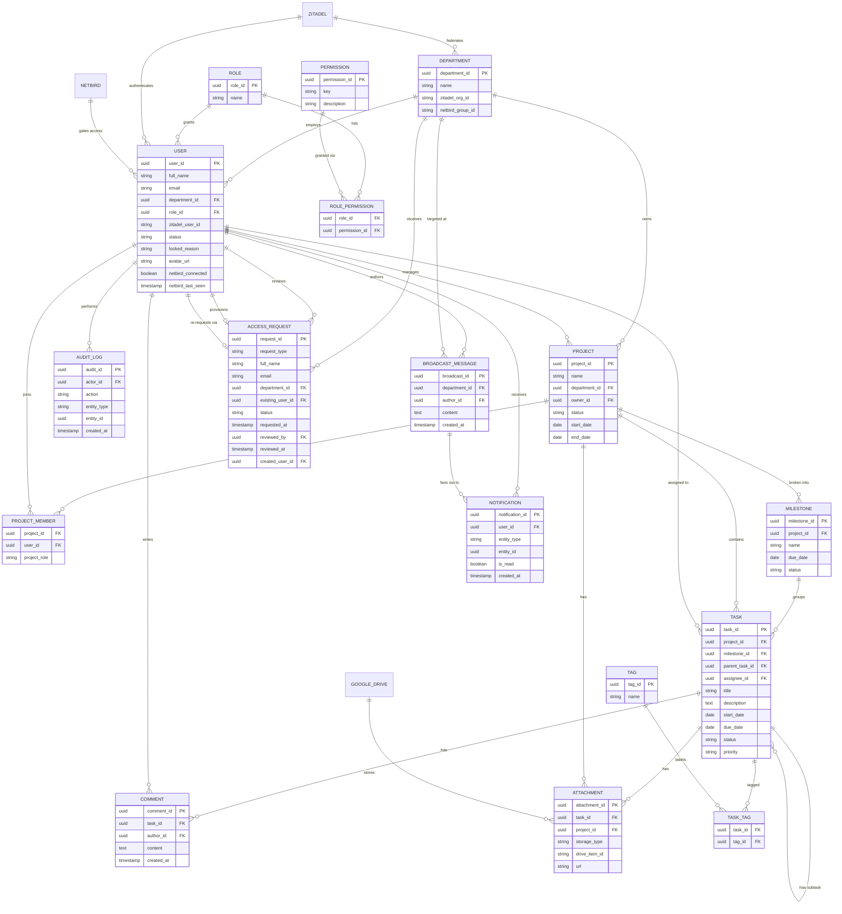

# Sơ đồ Quan hệ Thực thể (ERD) — Ứng dụng Web Quản lý Dự án

> Tài liệu này là bản chính thức (tiếng Việt) của ERD. Tên thực thể (entity), tên trường (field), và ký hiệu khóa chính/khóa ngoại (PK/FK) được **giữ nguyên bằng tiếng Anh** vì đây là định danh trong schema/code, không nên dịch — phần lời giải thích, tiêu đề mục, và mô tả được viết bằng tiếng Việt.
>
> **Ghi chú phiên bản (v2):** cập nhật sau khi đối chiếu `Project_Management_Functional_Requirements.pdf` với sơ đồ này, `PRD.md`, và `SRS.md`. Có 6 thay đổi — 4 thực thể mới (`MILESTONE`, `PERMISSION`, `ROLE_PERMISSION`, `BROADCAST_MESSAGE`) và bổ sung cho 3 thực thể đã có (`TASK`, `USER`, `ACCESS_REQUEST`) — để lấp các khoảng trống mà bảng FR phát hiện nhưng bản v1 chưa thể hiện được. Mỗi thay đổi được giải thích trong mục riêng bên dưới; không có gì ở v1 bị xóa hoặc đổi tên.

## Sơ đồ (Diagram)

Khối mã Mermaid dưới đây được **giữ nguyên bằng tiếng Anh** — đây là code render trực tiếp trên GitHub, dịch nhãn quan hệ có thể làm rối sơ đồ mà không tăng thêm giá trị.

`ZITADEL`, `NETBIRD`, và `GOOGLE_DRIVE` là hệ thống bên ngoài (không có schema riêng trong database này) — xem [Hệ thống bên ngoài](#hệ-thống-bên-ngoài) bên dưới.

## Thực thể & các trường

### DEPARTMENT (Phòng ban)

| Trường | Kiểu | Khóa |
|---|---|---|
| department_id | uuid | PK |
| name | string | |
| zitadel_org_id | string | |
| netbird_group_id | string | Có thể null. Cache id nhóm NetBird tương ứng, tạo lười (lazy) lần đầu có user thuộc phòng ban này cần cấp quyền mạng — cùng khuôn mẫu với `zitadel_org_id` |

### ROLE (Vai trò)

| Trường | Kiểu | Khóa |
|---|---|---|
| role_id | uuid | PK |
| name | string | |

### USER (Người dùng)

| Trường | Kiểu | Khóa |
|---|---|---|
| user_id | uuid | PK |
| full_name | string | |
| email | string | |
| department_id | uuid | FK → DEPARTMENT |
| role_id | uuid | FK → ROLE |
| zitadel_user_id | string | |
| status | string | `ACTIVE` \| `LOCKED` — bản sao cache của trạng thái khóa tài khoản, đồng bộ từ Zitadel qua webhook/event |
| locked_reason | string | Tùy chọn, có thể null. Ghi chú nội bộ app (vd. "đã nghỉ việc", "đang bị điều tra") — không phải dữ liệu định danh nên không lưu ở Zitadel |
| avatar_url | string | Có thể null. Ảnh đại diện — hỗ trợ tính năng "Đổi ảnh đại diện" (mọi vai trò) |
| netbird_connected | boolean | Cache, chỉ đọc. Đồng bộ từ NetBird qua webhook/poll — xem [Trạng thái kết nối NetBird](#trạng-thái-kết-nối-netbird) |
| netbird_last_seen | timestamp | Có thể null. Lần cuối NetBird ghi nhận user này đang kết nối |

### ACCESS_REQUEST (Yêu cầu cấp quyền truy cập)

Trạng thái trước-khi-có-tài-khoản **hoặc** yêu cầu lại sau khi bị khóa — xem [Luồng yêu cầu truy cập / onboarding](#luồng-yêu-cầu-truy-cập--onboarding).

| Trường | Kiểu | Khóa |
|---|---|---|
| request_id | uuid | PK |
| request_type | string | `NEW_ACCOUNT` (mặc định) \| `UNLOCK_REQUEST` |
| full_name | string | |
| email | string | |
| department_id | uuid | FK → DEPARTMENT (phòng ban được yêu cầu) |
| existing_user_id | uuid | FK → USER, có thể null — được set khi `request_type = UNLOCK_REQUEST`, liên kết đến tài khoản đang bị khóa |
| status | string | `PENDING` \| `APPROVED` \| `REJECTED` |
| requested_at | timestamp | |
| reviewed_by | uuid | FK → USER, có thể null — admin đã duyệt/từ chối |
| reviewed_at | timestamp | có thể null |
| created_user_id | uuid | FK → USER, có thể null — được set khi duyệt xong và tạo tài khoản (chỉ áp dụng luồng NEW_ACCOUNT) |

### PROJECT (Dự án)

| Trường | Kiểu | Khóa |
|---|---|---|
| project_id | uuid | PK |
| name | string | |
| department_id | uuid | FK → DEPARTMENT |
| owner_id | uuid | FK → USER |
| status | string | |
| start_date | date | |
| end_date | date | |

### PROJECT_MEMBER *(bảng nối: PROJECT ↔ USER)*

| Trường | Kiểu | Khóa |
|---|---|---|
| project_id | uuid | FK → PROJECT |
| user_id | uuid | FK → USER |
| project_role | string | |

### MILESTONE (Cột mốc)

| Trường | Kiểu | Khóa |
|---|---|---|
| milestone_id | uuid | PK |
| project_id | uuid | FK → PROJECT |
| name | string | |
| due_date | date | |
| status | string | |

### TASK (Công việc)

| Trường | Kiểu | Khóa |
|---|---|---|
| task_id | uuid | PK |
| project_id | uuid | FK → PROJECT |
| milestone_id | uuid | FK → MILESTONE, có thể null — task có thể thuộc một milestone hoặc gắn trực tiếp vào project |
| parent_task_id | uuid | FK → TASK (tự tham chiếu, dùng cho subtask) |
| assignee_id | uuid | FK → USER |
| title | string | |
| description | text | Có thể null. Nội dung mô tả chi tiết task, khác với `title` — hỗ trợ tính năng "Cập nhật mô tả Task" (PM/Admin) |
| start_date | date | Có thể null. Kết hợp với `due_date` để xác định thanh (bar) hiển thị trong Gantt view — xem [Lên lịch Task (hỗ trợ Gantt)](#lên-lịch-task-hỗ-trợ-gantt) |
| due_date | date | |
| status | string | |
| priority | string | |

### COMMENT (Bình luận)

| Trường | Kiểu | Khóa |
|---|---|---|
| comment_id | uuid | PK |
| task_id | uuid | FK → TASK |
| author_id | uuid | FK → USER |
| content | text | |
| created_at | timestamp | |

### ATTACHMENT (Tệp đính kèm)

| Trường | Kiểu | Khóa |
|---|---|---|
| attachment_id | uuid | PK |
| task_id | uuid | FK → TASK |
| project_id | uuid | FK → PROJECT |
| storage_type | string | |
| drive_item_id | string | |
| url | string | |

### TAG (Thẻ gắn nhãn)

| Trường | Kiểu | Khóa |
|---|---|---|
| tag_id | uuid | PK |
| name | string | |

### TASK_TAG *(bảng nối: TASK ↔ TAG)*

| Trường | Kiểu | Khóa |
|---|---|---|
| task_id | uuid | FK → TASK |
| tag_id | uuid | FK → TAG |

### NOTIFICATION (Thông báo)

| Trường | Kiểu | Khóa |
|---|---|---|
| notification_id | uuid | PK |
| user_id | uuid | FK → USER |
| entity_type | string | Bao gồm cả `BROADCAST_MESSAGE` bên cạnh các loại đã có (`TASK`, `COMMENT`, v.v.) |
| entity_id | uuid | Đa hình (polymorphic) — không có ràng buộc FK ở tầng DB, giống v1 |
| is_read | boolean | |
| created_at | timestamp | |

### AUDIT_LOG (Nhật ký hoạt động)

| Trường | Kiểu | Khóa |
|---|---|---|
| audit_id | uuid | PK |
| actor_id | uuid | FK → USER |
| action | string | |
| entity_type | string | |
| entity_id | uuid | |
| created_at | timestamp | |

### PERMISSION (Quyền)

Dữ liệu khởi tạo — xem [Danh sách seed cho PERMISSION](#danh-sách-seed-cho-permission) trong mục Ma trận phân quyền bên dưới.

| Trường | Kiểu | Khóa |
|---|---|---|
| permission_id | uuid | PK |
| key | string | Mã định danh ổn định, máy đọc được, vd. `task.status.update` |
| description | string | Nhãn dễ đọc cho người dùng, vd. "Update Task's Status" |

### ROLE_PERMISSION *(bảng nối: ROLE ↔ PERMISSION)*

| Trường | Kiểu | Khóa |
|---|---|---|
| role_id | uuid | FK → ROLE |
| permission_id | uuid | FK → PERMISSION |

### BROADCAST_MESSAGE (Thông báo toàn hệ thống)

| Trường | Kiểu | Khóa |
|---|---|---|
| broadcast_id | uuid | PK |
| department_id | uuid | FK → DEPARTMENT — workspace mà thông báo nhắm đến |
| author_id | uuid | FK → USER (Leader) |
| content | text | |
| created_at | timestamp | |

## Quan hệ (Relationships)

| Từ | Đến | Quan hệ | Số lượng |
|---|---|---|---|
| DEPARTMENT | USER | quản lý nhân sự | 1 : N |
| DEPARTMENT | PROJECT | sở hữu | 1 : N |
| ROLE | USER | cấp vai trò | 1 : N |
| USER | PROJECT | quản lý (chủ dự án) | 1 : N |
| PROJECT | PROJECT_MEMBER | bao gồm | 1 : N |
| USER | PROJECT_MEMBER | tham gia | 1 : N |
| PROJECT | MILESTONE | chia thành | 1 : N |
| MILESTONE | TASK | nhóm các | 1 : N |
| PROJECT | TASK | chứa | 1 : N |
| TASK | TASK | có subtask (tự tham chiếu qua parent_task_id) | 1 : N |
| USER | TASK | được giao cho | 1 : N |
| TASK | COMMENT | có | 1 : N |
| USER | COMMENT | viết | 1 : N |
| TASK | ATTACHMENT | có | 1 : N |
| PROJECT | ATTACHMENT | có | 1 : N |
| TASK | TASK_TAG | được gắn thẻ | 1 : N |
| TAG | TASK_TAG | gắn nhãn | 1 : N |
| USER | NOTIFICATION | nhận | 1 : N |
| USER | AUDIT_LOG | thực hiện | 1 : N |
| ROLE | ROLE_PERMISSION | có | 1 : N |
| PERMISSION | ROLE_PERMISSION | được cấp qua | 1 : N |
| USER | BROADCAST_MESSAGE | là tác giả | 1 : N |
| DEPARTMENT | BROADCAST_MESSAGE | được nhắm đến | 1 : N |
| BROADCAST_MESSAGE | NOTIFICATION | phân phối đến (đa hình, qua entity_type/entity_id) | 1 : N |
| DEPARTMENT | ACCESS_REQUEST | nhận | 1 : N |
| USER | ACCESS_REQUEST | duyệt (admin) | 1 : N |
| USER | ACCESS_REQUEST | cấp tài khoản (tạo tài khoản) | 1 : 0..1 |
| USER | ACCESS_REQUEST | yêu cầu lại qua (tài khoản bị khóa, UNLOCK_REQUEST) | 1 : 0..N |

`PROJECT_MEMBER`, `TASK_TAG`, và `ROLE_PERMISSION` là các bảng nối (association/join table) — thể hiện quan hệ nhiều-nhiều (many-to-many) tương ứng: PROJECT↔USER, TASK↔TAG, và ROLE↔PERMISSION.

## Hệ thống bên ngoài

| Hệ thống | Vai trò | Tích hợp |
|---|---|---|
| **Zitadel** (self-host) | IAM / SSO | Ánh xạ mỗi DEPARTMENT thành một Zitadel Organization (mô hình multi-tenant theo phòng ban); xác thực USER qua OIDC |
| **NetBird** (self-host) | VPN quản trị zero-trust | Kiểm soát truy cập tầng mạng cho USER; nguồn định danh liên kết OIDC với Zitadel |
| **Google Drive** | Lưu trữ tài liệu | Lưu nội dung ATTACHMENT, truy cập qua Google Drive API |

> **Ghi chú (2026-07-23):** Đổi từ Microsoft Graph API/SharePoint sang Google Drive API — Entra ID không có tenant miễn phí/tự đăng ký được ở quy mô dự án này (xem `markdown/SETUP.md`'s "Google Drive"). `attachment.sharepoint_item_id` đã được đổi tên thành `attachment.drive_item_id` và giá trị `storage_type` đổi từ `'SHAREPOINT'` sang `'GOOGLE_DRIVE'` qua `V10__rename_sharepoint_to_drive_item_id.sql`.

## Khóa/Mở khóa tài khoản

Khóa tài khoản là hành động ở **tầng Zitadel**, không phải flag trong DB này — vì Zitadel là nguồn định danh chung cho cả app lẫn NetBird, khóa một lần phải chặn cả hai.

- `USER.status` là **cache chỉ đọc**, đồng bộ qua webhook Zitadel — dùng để lọc user active nhanh (assignee picker, dashboard), không phải nguồn thật.
- `USER.locked_reason` là ghi chú nội bộ app, Zitadel không có khái niệm này.
- Khóa/mở khóa ghi vào `AUDIT_LOG` (`LOCK_USER` / `UNLOCK_USER`).
- User bị khóa muốn phục hồi → gửi `ACCESS_REQUEST` với `request_type = UNLOCK_REQUEST`.

## Trạng thái kết nối NetBird

- `USER.netbird_connected` / `netbird_last_seen`: cache chỉ đọc, đồng bộ từ NetBird — cùng khuôn mẫu với `USER.status`.
- Chỉ phục vụ hiển thị cho Admin; không tự kiểm soát truy cập (việc chặn thật vẫn do chính sách mạng của NetBird).

## Ma trận phân quyền (RBAC)

- `PERMISSION` + `ROLE_PERMISSION` cho phép Admin chỉnh quyền theo vai trò lúc runtime, thay vì hardcode.
- 4 dòng `ROLE` cố định; chỉ quyền gắn với vai trò là chỉnh được.
- Mọi endpoint nên phân quyền qua join `USER → ROLE → ROLE_PERMISSION → PERMISSION`.
- **Đã chốt Phương án B** (khớp mockup "Ma trận phân quyền"); dòng Admin bị khóa cứng cả client lẫn server.

### Danh sách seed cho PERMISSION

| `key` | `description` | Vai trò mặc định lúc seed |
|---|---|---|
| `dashboard.view.own` | Xem dashboard của mình | Tất cả |
| `project.view` | Xem tổng quan dự án | Tất cả |
| `project.view.multiview` | Xem Kanban/List/Gantt/Calendar | Tất cả |
| `project.view.all_departments` | Xem dự án mọi phòng ban, lọc được | Leader, Admin |
| `project.crud` | Tạo/sửa/lưu trữ dự án | PM, Admin |
| `milestone.crud` | Tạo/sửa/xóa milestone | PM, Admin |
| `task.crud` | Tạo/sửa/xóa task | PM, Admin |
| `task.subtask.crud` | CRUD subtask đầy đủ (không chỉ toggle status) | PM, Admin |
| `task.status.update` | Cập nhật trạng thái task/subtask được giao | Staff, PM, Admin |
| `task.priority.update` | Chỉnh mức ưu tiên task | PM, Admin |
| `task.assignee.update` | Đổi người phụ trách task | PM, Admin |
| `task.deadline.update` | Chỉnh deadline task | PM, Admin |
| `task.description.update` | Chỉnh mô tả task | PM, Admin |
| `task.comment.create` | Bình luận trên bất kỳ task nào | Tất cả |
| `task.comment.update` | Sửa bình luận của chính mình (không phải của người khác) | Tất cả |
| `task.comment.delete` | Xoá bình luận của chính mình (không phải của người khác) | Tất cả |
| `task.attachment.upload` | Đính kèm file Google Drive (giới hạn tốc độ) | Tất cả |
| `workspace.members.view` | Xem thành viên workspace của mình | Tất cả |
| `enterprise.members.view` | Xem thành viên toàn bộ workspace | Leader, Admin |
| `stats.view.own` | Xem thống kê cá nhân | Staff |
| `resource_allocation.view` | Xem workload/phân bổ nguồn lực | PM |
| `performance_risk.view` | Xem hiệu suất & rủi ro xuyên phòng ban | Leader |
| `notification.receive_realtime` | Nhận luồng thông báo real-time | Tất cả |
| `broadcast_message.send` | Gửi thông báo toàn workspace | Leader, Admin |
| `profile.avatar.update` | Đổi ảnh đại diện | Tất cả |
| `access_request.manage` | Duyệt/từ chối yêu cầu truy cập & mở khóa | Admin |
| `user.lock_unlock` | Khóa/mở khóa tài khoản | Admin |
| `user.role.change` | Thăng/giáng chức | Admin |
| `user.netbird_status.view` | Xem trạng thái NetBird theo user | Admin |
| `department.settings.update` | Chỉnh cài đặt workspace ⚠️ *(chờ `DEPARTMENT.settings` được định nghĩa)* | Admin |
| `authority_matrix.manage` | Chỉnh `ROLE_PERMISSION` (trừ dòng Admin) | Admin |
| `audit_log.view` | Xem nhật ký audit | Admin |
| `audit_log.export` | Xuất nhật ký audit ra CSV | Admin |

## Khởi tạo Admin đầu tiên

**Vấn đề:** mọi tài khoản (kể cả Admin) cần một Admin có sẵn để duyệt → Admin đầu tiên không có cách nào được tạo.

**Giải pháp:** migration seed chạy 1 lần, idempotent — tạo 1 `DEPARTMENT` + 1 `USER` (`role_id` = Admin) trỏ tới một định danh Zitadel được tạo thủ công trước đó ngoài luồng app. Không dùng kiểu "user đăng ký đầu tiên thành Admin" — đó là lỗ hổng bảo mật thường trực.

## Milestone

- `MILESTONE` nằm giữa `PROJECT` và `TASK`.
- `TASK.milestone_id` **có thể null** — task không bắt buộc thuộc milestone.
- `TASK.project_id` vẫn giữ để truy vấn nhanh, tránh luôn phải join qua `MILESTONE`.

## Lên lịch Task (hỗ trợ Gantt)

- Chỉ Gantt cần khoảng ngày; Kanban/List/Calendar dùng chung dữ liệu, không đổi schema.
- `TASK.start_date` (nullable) thêm vào để vẽ thanh Gantt theo `[start_date, due_date]`.
- `MILESTONE` chỉ cần `due_date` — hiển thị dạng điểm mốc, không phải thanh.

## Thông báo toàn hệ thống (Broadcast)

- `BROADCAST_MESSAGE`: 1 dòng/thông báo, gắn `department_id` + tác giả (Leader).
- Gửi đi tái dùng cơ chế đa hình sẵn có của `NOTIFICATION` (`entity_type = 'BROADCAST_MESSAGE'`) — không cần cơ chế mới.

## Luồng yêu cầu truy cập / onboarding

- `ACCESS_REQUEST` có 2 loại: **`NEW_ACCOUNT`** (chưa có `USER`) và **`UNLOCK_REQUEST`** (đã có `USER`, đang bị khóa, gắn qua `existing_user_id`).
- Duyệt `NEW_ACCOUNT` → tạo định danh Zitadel + dòng `USER` mới (`created_user_id` liên kết lại).
- Duyệt `UNLOCK_REQUEST` → chỉ mở khóa ở Zitadel, không tạo `USER` mới.
- Admin chỉ thấy/duyệt yêu cầu thuộc phòng ban mình quản trị (cô lập theo FR-1).
- Duyệt/từ chối đều ghi `AUDIT_LOG`.

---

*Xem thêm: [`PRD.md`](./PRD.md) cho bối cảnh sản phẩm, [`SRS.md`](./SRS.md) cho yêu cầu chức năng mà mô hình dữ liệu này hỗ trợ, [`API_Endpoints.md`](./API_Endpoints.md) cho đặc tả endpoint dựa trên schema này.*
